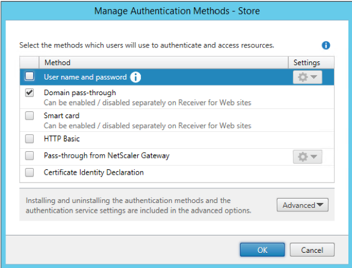

# Domain Pass-Through authentication types

StoreFront must be configured through the StoreFront console to offer the relevant protocol to the client. Enable the “Domain pass-through” protocol from the StoreFront console:

Note that other protocols can also be enabled in StoreFront without any negative effect. On the client AM is configured to use only the authentication method required for the Domain Pass-Through case.