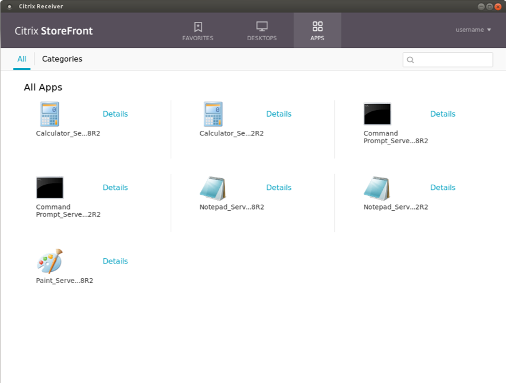

# Configuration

Domain Pass-Through uses Kerberos to authenticate the user to StoreFront, so Kerberos must be properly enabled and configured on the client before attempting an authentication.

## Receiver settings for Domain Pass-Through

To enable Domain Pass-Through on the Receiver, the following section must be added to the All_Regions.ini file located in the `$ICAROOT/config` directory:

```
[Logon\Local Credentials]
UseLocalUserAndPassword=*
EnableSSOThruICAFile=*
SSOnUserSetting=*
```

**Important**: In addition to the changes to the All_Regions.ini file, each of these configuration options must be specifically allowed by a line in a lockdown profile. If any of these options are missing or disabled in the lockdown profile, Citrix Receiver cannot use Domain Pass-Through authentication. Lockdown profiles prevent parameters from being modified in an ICA file. (Other parameters are protected from by other mechanisms.) For more information on lockdown profiles, see the text in All\_Regions.ini.

**Note**: Duplicate sections are not allowed in All_Regions.ini. To avoid error messages regarding duplicates, combine sections that have the same name.

## Kerberos installation

Most Linux distributions come with basic Kerberos functionality present, namely, at least some of the Kerberos-related packages are preinstalled. Consult the package manager of the Linux distribution that you are using in case you need to install any missing package.

Using Kerberos for Domain Pass-Through requires additional tools that are typically separate from the packages that bring core Kerberos functionality. To take advantage of Domain Pass-Through, you must install the package that includes the tools `kinit`, `klist` and `kdestroy`.

For example, on Ubuntu 14.04 LTS, those programs can be installed with the package `krb5-user`.

Moreover, if the client has to be configured to obtain Kerberos tickets using public-key credentials such as X.509 certificates or a smart card, any package that allows Kerberos pre-authentication must be installed as well.

Again, for reference, the name of the package that enables such functionality on an Ubuntu 14.4 LTS distribution is `krb5-pkinit`.

## Kerberos configuration

To use Kerberos to authenticate to StoreFront, a ticket-granting ticket (TGT) must first be obtained from the key distribution center (KDC) of the domain.
Before requesting a TGT, Kerberos must be configured.

The configuration file is typically found at: `/etc/krb5.conf`

This section covers only the basic settings required to enable Kerberos authentication for a single-domain scenario. If your environment is more complex, or if you need a more fine-tuned setup, see the official Kerberos documentation.

### Basic configuration example

The following configuration example assumes that the KDC resides on the domain controller:

```
[libdefaults]
    default_realm = YOURDOMAIN.NET
[realms]
    YOURDOMAIN.NET = {
        kdc = yourdc.yourdomain.net
        admin_server = yourdc.yourdomain.net
        default_domain = YOURDOMAIN.NET
    }
[domain_realm]
    .yourdomain.net = YOURDOMAIN.NET
    yourdomain.net = YOURDOMAIN.NET
```

### Smart card configuration example

The following configuration example allows for a TGT to be requested using a smart card instead of domain credentials. Again the example assumes that the KDC resides on the domain controller:

```
[libdefaults]
    default_realm = YOURDOMAIN.NET
[realms]
    YOURDOMAIN.NET = {
        kdc = yourdc.yourdomain.net
        admin_server = yourdc.yourdomain.net
        default_domain = YOURDOMAIN.NET
        pkinit_eku_checking = kpServerAuth
        pkinit_kdc_hostname = yourdc.yourdomain.net
        pkinit_anchors = FILE:/path/to/your/root/certificate.pem
        pkinit_identities = PKCS11:/path/to/your/PKCS11module.so
    }
[domain_realm]
    .yourdomain.net = YOURDOMAIN.NET
    yourdomain.net = YOURDOMAIN.NET
```

**Important**: the name specified under `pkinit_kdc_hostname` must match exactly the name of your domain controller and is case-sensitive.

The value of the field `pkinit_anchors` is the absolute path of the root PEM certificate to use for the connection to the host specified at `pkinit_kdc_hostname`. The value of the field `pkinit_identities` is the absolute path of the PKCS11 module to use to read the contents of the smart card you intend to use to get the Kerberos TGT. For example, on a typical 64 bit Ubuntu 14.04 LTS installation, the module can be found at `/usr/lib/x86_64-linux-gnu/opensc-pkcs11.so`.

Any change to the Kerberos configuration file takes effect immediately, with no need to restart the service between changes.

## Test Kerberos configuration

To test the Kerberos configuration, try to obtain a TGT from the KDC.
From the command line, execute:

```
kinit -f username
```
or:

```
kinit -f username@YOURDOMAIN.NET
```

where `username` is the name of the user for whom you want to get the TGT. If the domain is not specified, the domain indicated in the configuration file (at `default_realm`) is used by default.

The switch `-f` means that you are requesting a forwardable ticket. This might be useful when using the requested TGT to attempt a Kerberos authentication to a remote domain.
The command then asks you to provide credentials to complete the operation. Depending on your configuration, those can be either domain credentials or the PIN of the smart card.

To verify whether the previous command succeeded, execute: `klist`

The above command shows the contents of the ticket cache. If the kinit request was successful you should see that a TGT had been issued:

```
Ticket cache: FILE:/tmp/krb5cc_1000
Default principal: username@YOURDOMAIN.NET

Valid starting     Expires            Service principal
09/08/16 10:33:08  09/08/16 20:33:08  krbtgt/YOURDOMAIN.NET@YOURDOMAIN.NET
        renew until 10/08/16 10:33:00
```

If you can see something like the above, then Kerberos has been configured correctly and it is ready to use.

To remove all the tickets from the cache, use the command: `kdestroy`

Once you have obtained the TGT and enabled Domain Pass-Through authentication on StoreFront, you can launch Citrix Receiver and verify that the user for whom you requested a TGT gets logged on automatically and apps/desktops are enumerated:



To double-check that the Kerberos authentication was successful, launch the `klist` command again to see if you’ve been issued a ticket for the machine where StoreFront is installed:

```
Ticket cache: FILE:/tmp/krb5cc_1000
Default principal: username@YOURDOMAIN.NET

Valid starting     Expires            Service principal
09/08/16 10:33:08  09/08/16 20:33:08  krbtgt/YOURDOMAIN.NET@YOURDOMAIN.NET
        renew until 10/08/16 10:33:00
09/08/16 10:34:32  10/08/16 20:33:08  HTTP/sf.yourdomain.net@YOURDOMAIN.NET
        renew until 10/08/16 10:33:00
```

Notice the presence of a second ticket in the output above.

To launch an app/desktop, you must provide a valid set of credentials using the Credential Insertion SDK, as described in the next section.